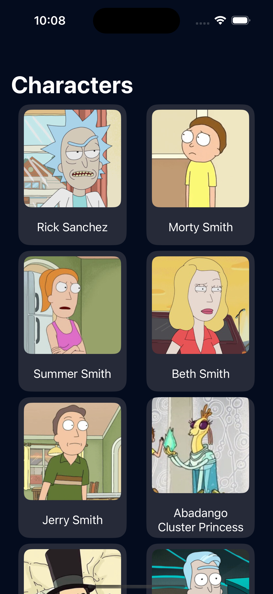
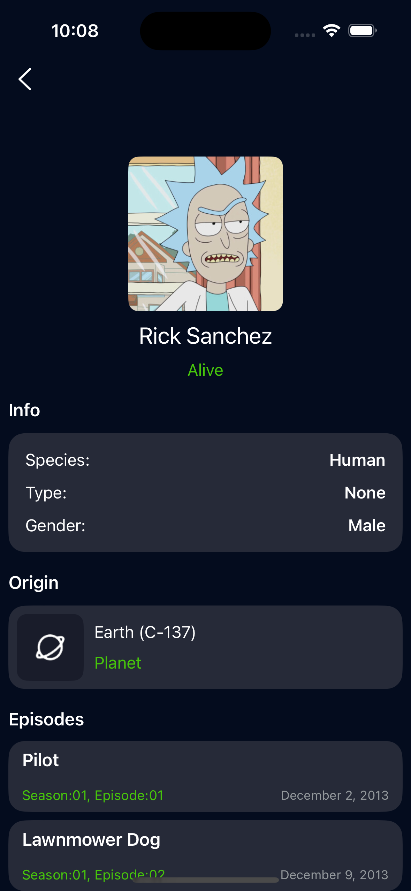

# RickAndMorty iOS app.

The application is not for commercial use.
The application was offered as a test task.

## About project

Application design taken from -> https://www.figma.com/file/JUuVDTfYCwDeuY1EsR76qH/Untitled?type=design&node-id=0-1&mode=design
For this application I used -> https://rickandmortyapi.com

Technology stack:
- Swift
- MVVM
- SwiftUI
- Concurency (async/await)

## Screenshots

### Characters page

### About character page

